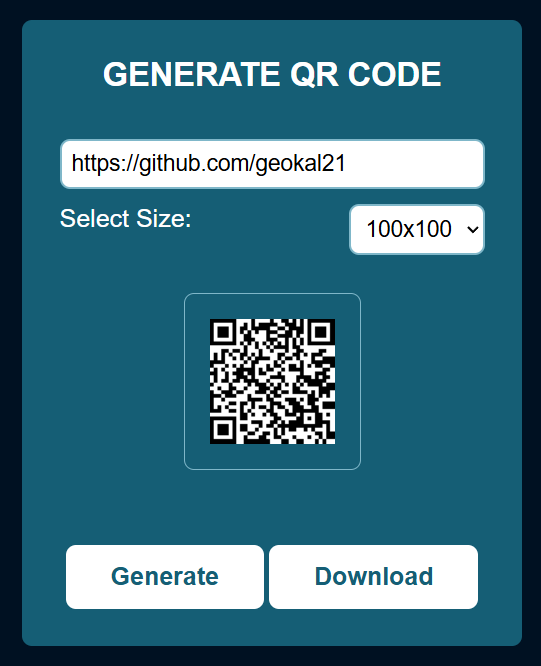

# 📱 QR Code Generator

A simple and elegant web application that generates QR codes instantly based on any text or URL you enter.  
Built with **HTML**, **CSS**, and **JavaScript** using the [QRCode.js](https://cdnjs.com/libraries/qrcodejs) library.

---

## 🚀 Features

- Generate QR codes from text or URLs  
- Choose between different sizes (100x100, 200x200, 300x300)  
- Download your QR code as a PNG image  
- Responsive design (works on mobile and desktop)  
- Clean and modern UI built with CSS variables

---

## 🛠️ Technologies Used

- **HTML5** for structure  
- **CSS3** for styling  
- **JavaScript (ES6)** for functionality  
- **QRCode.js** for generating the QR images

---

## 📂 Project Structure

qr-code-generator/
│
├── index.html # Main HTML file
├── style.css # Stylesheet for layout and colors
├── script.js # JavaScript logic for QR generation
└── README.md # Project documentation


---

## ⚙️ How to Use

1. Clone or download this repository:
   ```bash
   git clone https://github.com/your-username/qr-code-generator.git
2. Open the project folder and launch index.html in your browser.
3. Enter a text or URL into the input field.
4. Select a size from the dropdown menu.
5. Click Generate to create your QR code.
6. Click Download to save it as a PNG image.

---


## 📸 Preview



---


📦 Dependencies

The app uses the following external library via CDN:
<script src="https://cdnjs.cloudflare.com/ajax/libs/qrcodejs/1.0.0/qrcode.min.js"></script>

No installation required — everything runs in the browser.

---

👨‍💻 Author

Developed by George Kalikotsis
📧 [geokalik21@gmail.com]
